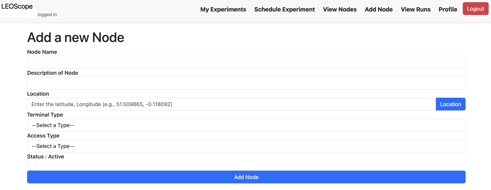

## Docker

Install the official `Docker` engine and the `compose` plugin following the official guide, instead of the `docker.io` package shipped with some distributions.

```bash
curl -fsSL https://get.docker.com | bash
```

The standalone `docker-compose` command is replaced by `docker compose`.

## Add a new node

1. Get the latest version of `LEOScope`.

```bash
git clone -b experiment-specific-stable https://github.com/leoscope-testbed/global-testbed
cd global-testbed
```

2. To add a new node to LEOScope, after obtaining the login credentials to the website https://leoscope.surrey.ac.uk, first add the node in the WebUI to get the `access_token`.



Update `docker-compose-node.yaml`, set `--nodeid` equal to the `node name` set when adding a new node in the WebUI, set `grpc-hostname` to `leoscope.surrey.ac.uk` with grpc port `50051` and the new access token.

Note that the `grpc-hostname` command line option in the `kernel` service should be set to `leoscope01.surrey.ac.uk` instead.

```diff
diff --git a/docker-compose-node.yaml b/docker-compose-node.yaml
index 8ed04b8..8fa160f 100644
--- a/docker-compose-node.yaml
+++ b/docker-compose-node.yaml
@@ -6,14 +6,14 @@ services:
       dockerfile: "docker/node/Dockerfile"
     image: "leotest-scheduler"
     command:
-      - "--nodeid=test-node"
-      - "--grpc-hostname=<Orchestrator-node-IP-Address>"
-      - "--grpc-port=<Port>"
+      - "--nodeid=star-victoria-node"
+      - "--grpc-hostname=leoscope.surrey.ac.uk"
+      - "--grpc-port=50051"
       - "--interval=10"
       - "--workdir=/leotest/"
       - "--artifactdir=/artifacts/"
       - "--executor-config=/executor-config.yaml"
-      - "--access-token=<Access-Token>"
+      - "--access-token=..."

     volumes:
       - /var/run/docker.sock:/var/run/docker.sock
@@ -38,10 +38,10 @@ services:
     privileged: true
     hostname: "leotest_kernel_service"
     command:
-      - "--nodeid=test-node"
-      - "--grpc-hostname=<IP Address>"
-      - "--grpc-port=<Port>"
-      - "--access-token=<Access Token>"
+      - "--nodeid=star-victoria-node"
+      - "--grpc-hostname=leoscope01.surrey.ac.uk"
+      - "--grpc-port=50051"
+      - "--access-token=..."
       - "--leotest-net=global-testbed_leotest-net"

     volumes:
```

3. Update `--grpc-host` in `cli/__main__.py` to `leoscope.surrey.ac.uk`.

```diff
diff --git a/cli/__main__.py b/cli/__main__.py
index 11aed68..6fd46be 100644
--- a/cli/__main__.py
+++ b/cli/__main__.py
@@ -8,7 +8,7 @@ def main():
     parser = argparse.ArgumentParser(description='Leotest command line interface.')

     parser.add_argument("--grpc-host", type=str, required=False,
-                                            default='20.168.9.14',
+                                            default='leoscope.surrey.ac.uk',
                                             help='gRPC host')
```

4. Update `cern_cn` in `common/client.py` to `leoscope01.surrey.ac.uk` and update the corresponding SSL certificate files.

```diff
diff --git a/common/client.py b/common/client.py
index 81d67cb..96dea41 100644
--- a/common/client.py
+++ b/common/client.py
@@ -81,7 +81,8 @@ class LeotestClient:
                 # channel = grpc.insecure_channel(
                 #     '{}:{}'.format(self.grpc_hostname, self.grpc_port))

-                with open('certs/server.crt', 'rb') as f:
+                # with open('certs/server.crt', 'rb') as f:
+                with open('certs/star_surrey_ac_uk.crt', 'rb') as f:
                     trusted_certs = f.read()

                 credentials = grpc.ssl_channel_credentials(root_certificates=trusted_certs)
@@ -95,7 +96,7 @@ class LeotestClient:
                 # use this if you want standard "Authorization" header
                 #call_credentials = grpc.access_token_call_credentials("test_access_token")

-                cert_cn = "localhost" # or parse it out of the cert data
+                cert_cn = "leoscope01.surrey.ac.uk"
                 options = (('grpc.ssl_target_name_override', cert_cn,),)

                 composite_credentials = grpc.composite_channel_credentials(credentials, call_credentials)
```

5. Start the node with `docker compose` as `docker compose -f docker-compose-node.yaml up -d`, and it will start the following components.

```bash
docker compose -f docker-compose-node.yaml ps
NAME                      IMAGE                      COMMAND                  SERVICE               CREATED             STATUS                      PORTS
global-testbed-kernel-1   leotest-kernel-service     "python -m services.…"   kernel                37 minutes ago      Up 37 minutes
global-testbed-node-1     leotest-scheduler          "python -m node --no…"   node                  37 minutes ago      Up 37 minutes
leotest-message-queue     eclipse-mosquitto:latest   "/docker-entrypoint.…"   mqtt                  37 minutes ago      Up 37 minutes (unhealthy)   0.0.0.0:1883->1883/tcp, :::1883->1883/tcp, 0.0.0.0:9001->9001/tcp, :::9001->9001/tcp
leotest-session-cache     memcached:latest           "docker-entrypoint.s…"   memcached             37 minutes ago      Up 37 minutes (unhealthy)   11211/tcp
leotest-tmp-store         redis                      "docker-entrypoint.s…"   redis                 37 minutes ago      Up 37 minutes (healthy)     6379/tcp
starlink-grpc-tools       leotest-starlink-api       "python check_grpc.p…"   starlink-grpc-tools   37 minutes ago      Up 37 minutes
```
